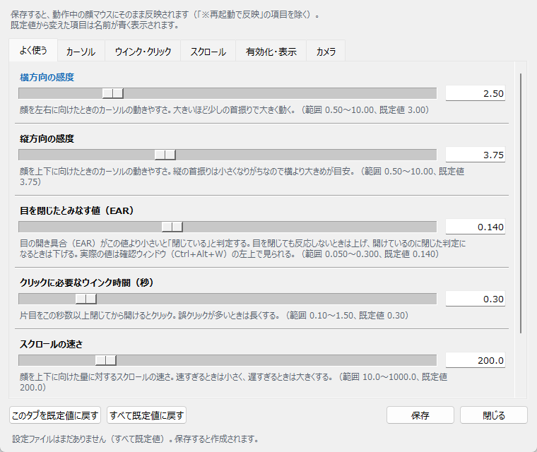

# eyetracking-ui — 顔の向きとウインクでマウスを操作する

Webカメラに映った顔をMediaPipeで解析し、**顔の向き（鼻先の位置）でカーソルを動かし、ウインクでクリックする**
ハンズフリーのマウス操作ツールです。手がふさがっているとき、手袋をしているときなどに、
マウスに触れずにWindowsを操作できます。

視線だけでカーソルを動かす方式は精度が低くブレやすいため、カーソル移動は顔の向き、
クリックはウインク、というハイブリッド方式を採用しています。

## 必要環境

- Windows 10 / 11（グローバルホットキーと画面上部の状態表示は Windows 専用）
- Python 3.12（uv が用意します）
- Webカメラ（640x480 程度で十分。ノートPCの内蔵カメラで可）

## セットアップ

依存関係は [uv](https://docs.astral.sh/uv/) で管理しています（`pyproject.toml` / `uv.lock`）。
uv が無い場合は `pip install uv` か、公式のインストーラで入れてください。

```bash
uv sync
```

`.venv` に Python 3.12 と依存パッケージ（mediapipe / opencv-contrib-python / pyautogui）が入ります。

```bash
uv run scripts/download_model.py
```

顔のランドマーク検出モデル（約3.6MB）を `models/face_landmarker.task` に保存します。
社内プロキシ等でダウンロードできない場合は、スクリプト内のURLをブラウザで開いて
同じ場所に手動で保存してください。

ネットワークにつながらないPCへの導入手順は [利用マニュアル 第2部](docs/manual.md#3-インストールネットにつながらないpc) を参照してください。

## 起動

**`start_face_mouse.bat` をダブルクリック**で起動できます。初回は `.venv` の作成とモデルの取得も自動で行います。

```bash
uv run scripts/face_mouse.py
```

でも起動できます。起動すると画面上部中央に、半透明の小さな状態表示が出ます。

**安全のため、起動直後はマウス操作が無効**になっています。**両目を2秒閉じる**と有効になります。

## 操作

| 操作 | 動作 |
|---|---|
| 顔を上下左右に向ける | カーソル移動（有効にした瞬間の顔の位置が画面中央） |
| 左目だけを0.3秒以上閉じて、1秒以内に開ける | 左クリック |
| 左目だけを1秒閉じ続ける | ダブルクリック |
| 右目だけを0.3秒以上閉じて、2秒以内に開ける | 右クリック |
| 右目だけを2秒閉じ続ける | スクロール保持モード（カーソルを止め、顔の上下でスクロール。もう一度ウインクで解除） |
| 両目を2秒閉じる | 有効にする（無効のとき） |
| 両目を5秒閉じる | 無効に戻す（有効のとき） |
| 両目のまばたき | 無視される |

片目を閉じている間はカーソルが止まるので、狙った位置でクリックできます。
「左目」「右目」は本人から見た左右です。

## 画面表示

画面上部中央に、最前面・半透明・クリック透過の状態表示が常に出ます（タスクバーにも出ず、フォーカスも奪いません）。

| 表示 | 意味 |
|---|---|
| `顔マウス：無効（両目2秒で有効）` | 無効。カーソルは動かずクリックもしない |
| `顔マウス：有効` | 有効 |
| `顔マウス：顔が見つかりません` | カメラに顔が映っていない |

表示の後ろに `LEFT CLICK`、`L-HOLD 0.6s / 1.0s`（ダブルクリックまでの経過時間）、
`SCROLL ▼`（スクロール中）などが一時的に出ます。

カメラ映像の確認ウィンドウ（ランドマークとEAR値を表示）は、起動時には出ません。`Ctrl+Alt+W` で表示できます。

## 安全装置とホットキー

| 操作 | 内容 |
|---|---|
| **`Ctrl+Alt+P`** | 有効／無効の切り替え |
| **`Ctrl+Alt+C`** | 今の顔の位置を中心に設定し直す |
| **`Ctrl+Alt+W`** | 確認ウィンドウの表示／非表示 |
| **`Ctrl+Alt+S`** | 設定画面を開く |
| **`Ctrl+Alt+Q`** | 終了 |
| 本物のマウスを画面の四隅へ動かす | 緊急停止（pyautogui の FAILSAFE） |

ホットキーは**どのウィンドウにフォーカスがあっても効く**グローバルホットキーです。
キー入力は横取りしないので、操作中のアプリにも同じキーが届きます。

## 設定の調整

### 設定画面（おすすめ）

**`settings_face_mouse.bat`** をダブルクリックするか、動作中に **`Ctrl+Alt+S`** を押すと設定画面が開きます。



- 項目はタブで分かれています。よく触るものは先頭の「よく使う」タブにまとめてあります
- スライダーでも、右の欄に直接数値を打ち込んでも変更できます
- 各項目の下に、何をする値で、大きくするとどうなるかを書いてあります
- **保存すると、動作中のアプリにそのまま反映されます**（約1秒以内。再起動は不要）。
  カメラ番号など起動時にしか読まない項目は「※再起動で反映」と表示されます
- 設定は `scripts/face_mouse_config.json` に保存されます（PCごとの設定なので Git には含めません）

設定画面はアプリを起動していなくても開けます（その場合は次回の起動時に反映されます）。

### 既定値（コード内の定数）

既定値は `scripts/face_mouse.py` 冒頭の定数です。設定画面で保存した値があれば、そちらが優先されます。主な項目:

| 定数 | 既定値 | 説明 |
|---|---|---|
| `SENSITIVITY_X` / `SENSITIVITY_Y` | 3.0 / 3.75 | カーソル感度（大きいほど少ない首振りで大きく動く） |
| `SMOOTHING_ALPHA` | 0.25 | 指数平滑化の係数（小さいほど滑らかだが遅れる） |
| `DEAD_ZONE_PX` | 4 | この距離(px)未満の移動は無視する |
| `EAR_CLOSED_THRESHOLD` | 0.14 | EAR（目の開き具合）がこれ未満なら「閉じている」とみなす |
| `WINK_EAR_DIFF` / `WINK_KEEP_EAR_DIFF` | 0.05 / 0.03 | ウインク開始／継続に必要な左右のEAR差 |
| `WINK_HOLD_SEC` | 0.3 | ウインクとみなす最短時間 |
| `DOUBLE_CLICK_HOLD_SEC` | 1.0 | 左ウインクでダブルクリックになる時間 |
| `SCROLL_HOLD_SEC` | 2.0 | 右ウインクでスクロール保持モードになる時間 |
| `SCROLL_SPEED_GAIN` / `SCROLL_MAX_NOTCHES_PER_SEC` | 200 / 20 | スクロール速度の係数と上限（ホイール段数/秒） |
| `SCROLL_DEAD_ZONE` | 0.015 | スクロールしない上下の動きの範囲 |
| `CLICK_COOLDOWN_SEC` | 1.0 | クリック後、次を受け付けるまでの時間 |
| `ACTIVATE_HOLD_SEC` / `DEACTIVATE_HOLD_SEC` | 2.0 / 5.0 | 両目を閉じて有効化／無効化するまでの時間 |
| `START_PAUSED` | True | 起動直後を無効状態にする |
| `OVERLAY_ALPHA` | 0.55 | 画面上部の状態表示の不透明度 |
| `CAMERA_INDEX` | 0 | 使用するカメラ番号 |

EARの値は確認ウィンドウ（`Ctrl+Alt+W`）の左上で見られます。目を閉じても判定されないときは
`EAR_CLOSED_THRESHOLD` を上げてください。症状別の調整方法は [利用マニュアル 第2部 5章](docs/manual.md#5-感度しきい値の調整) にまとめています。

## ドキュメント

- [利用マニュアル（Markdown）](docs/manual.md) / [HTML版](docs/manual.html) … 利用者向けの操作説明と、導入担当者向けのセットアップ・調整手順
- [使い方メモ](docs/usage.md) … 開発者向けメモ
- [コード構造マップ](docs/CODEMAP.md) … `scripts/gen_codemap.py` で自動生成

## ファイル構成

```
start_face_mouse.bat     起動用バッチ（初回は環境構築とモデル取得も行う）
settings_face_mouse.bat  設定画面を開くバッチ
scripts/
  face_mouse.py          メインアプリ（カメラ→顔検出→カーソル移動・クリック判定→表示）
  face_mouse_settings.py 設定画面（tkinter）
  settings_schema.py     設定項目の定義と設定ファイルの読み書き
  face_mouse_config.json 設定画面で保存した設定（保存時に作成。Git には含めない）
  download_model.py      検出モデルのダウンロード
  gen_codemap.py         docs/CODEMAP.md の自動生成
models/
  face_landmarker.task   MediaPipeの検出モデル（download_model.py で取得）
docs/                    マニュアル・メモ
```

## 制限事項

- 姿勢が大きく変わると中心がずれます。`Ctrl+Alt+C` で中心を設定し直してください
- 逆光・暗所・目元が隠れる状態（帽子のつば、反射の強いメガネなど）では認識が不安定になります
- カーソル移動はプライマリモニタの範囲が対象です

## ライセンス

[MIT License](LICENSE) — 自由に利用・改変・再配布できます。

顔検出モデル（`face_landmarker.task`）は Google の [MediaPipe](https://github.com/google-ai-edge/mediapipe) が
配布しているもので、このリポジトリには含めていません（`scripts/download_model.py` で配布元から取得します）。
